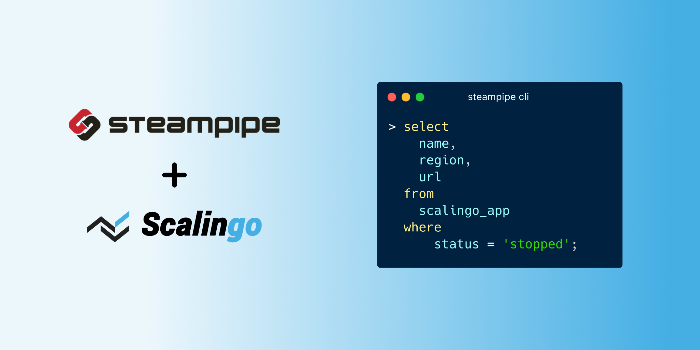

# Scalingo plugin for Steampipe

Use SQL to query infrastructure including applications and addons from [Scalingo][].

- **[Get started →](docs/index.md)**
- Documentation: [Table definitions & examples](docs/tables)

## Quick start

Install the plugin with [Steampipe][]:

    steampipe plugin install francois2metz/scalingo

## Development

To build the plugin and install it in your `.steampipe` directory

    make

Copy the default config file:

    cp config/scalingo.spc ~/.steampipe/config/scalingo.spc

## License

Apache 2

[steampipe]: https://steampipe.io
[scalingo]: https://scalingo.com
